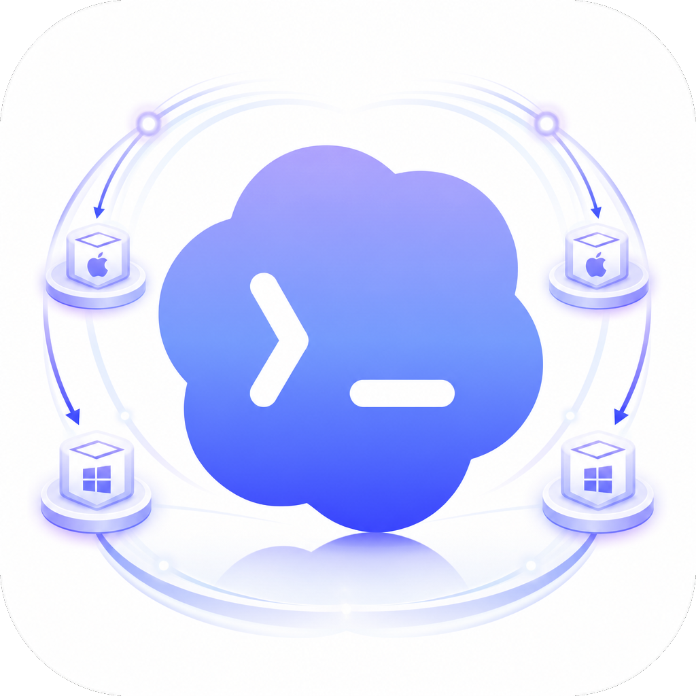

<p align="center">
  
</p>

<p align="center">
  
</p>

<h1 align="center">codex-app-mirror</h1>

<p align="center">
  把官方 Codex 桌面应用安装包，原样、可校验、国内可达地镜像到 GitHub Release，<br>
  并为 macOS 提供 Sparkle 增量自动更新源。
</p>

<p align="center">
  <a href="https://github.com/Wangnov/codex-app-mirror/releases/latest"></a>
  <a href="https://github.com/Wangnov/codex-app-mirror/stargazers"></a>
  <a href="https://github.com/Wangnov/codex-app-mirror/releases/latest"></a>
  <a href="https://github.com/Wangnov/codex-app-mirror/actions/workflows/mirror.yml"></a>
  <a href="https://github.com/Wangnov/codex-app-mirror/actions/workflows/mirror.yml"></a>
  <a href="https://github.com/Wangnov/codex-app-mirror/releases/latest"></a>
  <a href="https://apps.microsoft.com/detail/9plm9xgg6vks"></a>
  <a href="https://github.com/Wangnov/codex-app-mirror/releases/latest"></a>
  <a href="./LICENSE"></a>
</p>

<p align="center">
  <a href="#readme-cn">中文</a> · <a href="#readme-en">English</a>
</p>

---

<!-- ⬇ 赞助商 SPONSOR（最顶部，中英双语共享；专属注册链接/优惠码待补，现用主站占位） -->
<div align="center">
<table>
  <tr>
    <td align="center" width="170">
      <a href="https://duckcoding.ai"></a>
    </td>
    <td width="560">
      <b>本项目由 <a href="https://duckcoding.ai">DuckCoding</a> 赞助支持</b><br>
      面向国内开发者的 Claude Code / Codex / Gemini CLI API 中转，国内直连、按量计费。<br>
      <b>Sponsored by <a href="https://duckcoding.ai">DuckCoding</a></b> — a pay-as-you-go API relay for Claude Code / Codex / Gemini CLI.
    </td>
  </tr>
</table>
</div>

---

<a id="readme-cn"></a>

# 中文

`codex-app-mirror` 是面向 OpenAI Codex 桌面应用的安装包镜像与分发项目，用于在 Microsoft Store 或官方下载不便时提供稳定且可校验的获取渠道。项目仅做镜像，不构建、不修改、不重打包 Codex：按版本探测结果将官方来源的 Windows MSIX 与 macOS DMG 原样发布到 GitHub Release，并经 CDN 短链分发。macOS 端另提供 Sparkle 增量更新 appcast，由下游 [Codex App Manager](#cn-ecosystem) 客户端消费。

## 能力一览

| 能力 | 说明 |
|---|---|
| 🪟 **Windows MSIX** | 直接镜像 Microsoft Store 包，绕开 `winget` / Entra ID 认证 |
| 🍎 **macOS DMG** | Apple Silicon + Intel 双架构，官方原包，零改动 |
| 🔄 **增量自动更新** | macOS Sparkle appcast + delta 差量包，pinned EdDSA 签名字节级保真 |
| 🌏 **国内可达** | Cloudflare R2 全球节点 + 中国大陆自动分流到 S3 副镜像，同一条短链全自动选路 |
| ⏱️ **15 分钟探测** | Cloudflare Cron 主调度 + GitHub Actions 6 小时兜底，上游一变就发版 |
| 🔐 **可校验** | 每个 Release 附 `SHA256SUMS.txt` 与 `release-manifest.json` 上游指纹 |

## 下载与安装

打开 [最新 GitHub Release](https://github.com/Wangnov/codex-app-mirror/releases/latest)，下载你的平台对应文件：

- **Windows**：`OpenAI.Codex_..._x64__2p2nqsd0c76g0.Msix`
- **Apple Silicon Mac**：`Codex-mac-arm64.dmg`
- **Intel Mac**：`Codex-mac-x64.dmg`

或直接使用 CDN 短链（推荐，**自动按你的网络选最优节点**——国内走 S3 副镜像，海外走 R2，只保留当前最新版）：

| 平台 | 短链 |
|---|---|
| Windows | <https://codexapp.agentsmirror.com/latest/win> |
| Apple Silicon Mac | <https://codexapp.agentsmirror.com/latest/mac-arm64> |
| Intel Mac | <https://codexapp.agentsmirror.com/latest/mac-intel> |
| 校验和 | <https://codexapp.agentsmirror.com/latest/checksums> |
| Release 指纹 | <https://codexapp.agentsmirror.com/latest/manifest> |

需要**历史版本**时，到 [GitHub Releases](https://github.com/Wangnov/codex-app-mirror/releases) 按 release/tag 查找；短链只指向最新版。建议同时下载 `SHA256SUMS.txt` 核对文件完整性。

## macOS 自动更新

macOS 版除了手动下载 DMG，还支持 **Sparkle 增量自动更新**。下游的 Codex App Manager 客户端会订阅本镜像的 appcast，自动检查新版并**只下载版本间的 delta 差量包**，而不是每次重拉完整安装包：

- Apple Silicon：<https://codexapp.agentsmirror.com/latest/appcast.xml>
- Intel：<https://codexapp.agentsmirror.com/latest/appcast-x64.xml>

镜像**逐字节复制**官方 Sparkle 归档和 OpenAI 的 EdDSA 签名，只改写 `enclosure` 的下载地址指向镜像。由于 EdDSA 签的是归档字节本身，只要镜像与官方字节级一致，**原始签名依然有效**——本镜像不会、也无法伪造签名。如果客户端没有匹配的 delta，会自动回退到完整归档。

## 工作原理

### 探测 → 比对 → 发布

每次运行先做一次轻量探测，只有上游真的变了才下载和发版：

- **Windows**：通过 Microsoft Store DisplayCatalog 拿到 `WuCategoryId`，再用 FE3 metadata 解析当前 MSIX moniker 和临时 Microsoft CDN URL
- **macOS**：对官方 DMG 与 appcast 发请求，读取 `ETag` / `Last-Modified` / `Content-Length` 与 appcast 版本字段
- **比对**：与最新 Release 的 `release-manifest.json` 做稳定字段比较

没有变化就在探测阶段结束，不下载、不发重复 Release。任一平台有变化，则下载三平台安装包、生成校验和与 manifest、构建 Sparkle appcast，发布新的 GitHub Release。

### 双层镜像 + 按地域分流

发布后，资产会同步到两套镜像，由一个 Cloudflare Worker 路由：

- **全球**：Cloudflare R2（`codexapp-r2.agentsmirror.com`）
- **中国大陆**：S3 副镜像，通过预签名 URL 下发

路由器读取请求的 `CF-IPCountry`，把中国大陆访客分流到 S3 副镜像，其余走 R2——**对用户透明，同一条短链全自动选路**。

### 调度

- **主调度**：Cloudflare Cron Trigger，每 15 分钟触发一次 `mirror.yml`（`workflow_dispatch`）
- **兜底**：GitHub Actions 自带 `schedule`，每 6 小时一次（`11 */6 * * *`）——防止 GitHub 计划任务被延迟或跳过时漏检

<a id="cn-ecosystem"></a>

### 生态：Codex App Manager

本镜像不只是给人手动下载——它是 **Codex App Manager** 桌面客户端的更新后端。客户端在本地检测平台与能力，并消费这里的 Sparkle appcast 完成安装与增量更新。镜像保持窄而稳，把"分发与更新"这层基础设施沉淀下来。

## 版本号说明

Windows 和 macOS 的版本号来自不同上游包，不保证完全一致。Windows MSIX 使用 Microsoft Store 包名里的四段版本，例如 `26.513.3673.0`；macOS 使用 DMG 内 `Codex.app/Contents/Info.plist` 的 `CFBundleShortVersionString` 和 `CFBundleVersion`，例如 `26.513.31313` build `2867`。

Release tag 会同时写明两边版本：

```text
codex-app-win-26.513.3673.0-mac-26.513.31313-b2867
```

当前 Windows 包名形如：

```text
OpenAI.Codex_<version>_x64__2p2nqsd0c76g0.Msix
```

## Windows 提示「已被系统管理员阻止」怎么办

如果双击 `.Msix` 时提示“你的系统管理员已阻止此程序。有关详细信息，请与你的系统管理员联系。”，通常不是下载文件损坏，而是当前系统策略不允许从商店外安装 MSIX / AppX 包，或者应用安装器 / AppX 部署服务被管理员禁用。

可以按这个顺序排查：

- 优先尝试从 [Microsoft Store 官方页面](https://apps.microsoft.com/detail/9plm9xgg6vks)安装 Codex App。
- 如果这是你自己的电脑，确认系统允许安装任意来源应用，并确认应用安装器可用。
- 需要看更详细错误时，可以在管理员终端里运行：`Add-AppxPackage -Path .\OpenAI.Codex_..._x64__2p2nqsd0c76g0.Msix`
- 如果这是公司、学校或其他受组织策略管理的设备，需要联系设备管理员放行；本镜像不会也不能绕过这些本机安装策略。

## 上游来源

macOS DMG 使用 OpenAI Codex 桌面安装器的官方静态地址，并以官方 appcast 锁定版本：

- `https://persistent.oaistatic.com/codex-app-prod/Codex.dmg`
- `https://persistent.oaistatic.com/codex-app-prod/Codex-latest-x64.dmg`

Windows MSIX 使用 Microsoft Store metadata 解析：

- **DisplayCatalog**：查询 ProductId `9PLM9XGG6VKS`
- **FE3**：获取与当前 Windows Desktop x64 条件匹配的包 metadata
- **Microsoft CDN**：下载 FE3 返回的临时包 URL

仓库内的解析器是纯 .NET 实现，不依赖 `StoreLib` 这类第三方 Store helper 包。

## 这个仓库不会做什么

- 不修改 Codex 安装包
- 不破解 Microsoft Store 或 OpenAI 的授权逻辑
- 不伪造或重新计算 Sparkle 签名（只字节级复制官方签名）
- 不保留 Microsoft CDN 临时 URL 作为长期下载地址
- 不保证安装包能绕过你本机的 Windows AppX / MSIX 安装策略
- 不替代 OpenAI、Microsoft 或 Microsoft Store 的官方分发渠道

## 致谢

- **[LINUX DO](https://linux.do/)** 社区——下载链路、安装体验、校验结果的讨论与反馈都汇聚于此。
- **中国科学院高能物理研究所（IHEP）**——提供国内 S3 镜像存储，让中国大陆的下载与更新低延迟直达。

## Star History

<p align="center">
  <a href="https://star-history.com/#Wangnov/codex-app-mirror&Date">
    <picture>
      <source media="(prefers-color-scheme: dark)" srcset="https://api.star-history.com/svg?repos=Wangnov/codex-app-mirror&type=Date&theme=dark" />
      
    </picture>
  </a>
</p>

## 许可

[MIT](./LICENSE)。本项目与 OpenAI、Microsoft 无隶属或背书关系。

---

<a id="readme-en"></a>

# English

`codex-app-mirror` is an installer mirror and distribution project for the OpenAI Codex desktop app, providing a stable, verifiable way to obtain it when the Microsoft Store or official downloads are inconvenient. The project only mirrors — it does not build, modify, or repackage Codex: it publishes the official Windows MSIX and macOS DMG verbatim to GitHub Releases based on version probing, and serves them over CDN short links. For macOS it also provides a Sparkle incremental-update appcast, consumed by the downstream [Codex App Manager](#en-ecosystem) client.

## At a glance

| Capability | Detail |
|---|---|
| 🪟 **Windows MSIX** | Mirrored from the Microsoft Store package — no `winget` / Entra ID needed |
| 🍎 **macOS DMG** | Apple Silicon + Intel, official packages, unmodified |
| 🔄 **Incremental auto-update** | macOS Sparkle appcast + delta enclosures, pinned EdDSA signatures kept byte-for-byte |
| 🌏 **Reachable in China** | Cloudflare R2 globally + auto-failover to an S3 mirror for mainland China; one link, auto-routed |
| ⏱️ **15-minute probe** | Cloudflare Cron primary + GitHub Actions 6-hour fallback; releases only when upstream changes |
| 🔐 **Verifiable** | Every release ships `SHA256SUMS.txt` and a `release-manifest.json` of upstream fingerprints |

## Download & install

Open the [latest GitHub Release](https://github.com/Wangnov/codex-app-mirror/releases/latest) and grab your platform's asset:

- **Windows**: `OpenAI.Codex_..._x64__2p2nqsd0c76g0.Msix`
- **Apple Silicon Mac**: `Codex-mac-arm64.dmg`
- **Intel Mac**: `Codex-mac-x64.dmg`

Or use the CDN short links (recommended — **auto-routed to the fastest node**: mainland China via the S3 mirror, elsewhere via R2; latest version only):

| Platform | Short link |
|---|---|
| Windows | <https://codexapp.agentsmirror.com/latest/win> |
| Apple Silicon Mac | <https://codexapp.agentsmirror.com/latest/mac-arm64> |
| Intel Mac | <https://codexapp.agentsmirror.com/latest/mac-intel> |
| Checksums | <https://codexapp.agentsmirror.com/latest/checksums> |
| Release manifest | <https://codexapp.agentsmirror.com/latest/manifest> |

For **older versions**, browse [GitHub Releases](https://github.com/Wangnov/codex-app-mirror/releases) by release/tag — the short links only point at the latest. Download `SHA256SUMS.txt` too if you want to verify integrity.

## macOS auto-update

Beyond manual DMG downloads, macOS supports **Sparkle incremental auto-update**. The downstream Codex App Manager client subscribes to this mirror's appcast and downloads only the **delta between versions** rather than the full installer each time:

- Apple Silicon: <https://codexapp.agentsmirror.com/latest/appcast.xml>
- Intel: <https://codexapp.agentsmirror.com/latest/appcast-x64.xml>

The mirror copies the official Sparkle archives and OpenAI's EdDSA signatures **byte-for-byte**, rewriting only the `enclosure` URL to point at the mirror. Because EdDSA signs the archive bytes themselves, the original signature stays valid as long as the mirror is byte-identical — the mirror never forges or recomputes a signature. Clients with no matching delta fall back to the full archive.

## How it works

### Probe → compare → release

Each run starts with a lightweight probe and only downloads/releases when upstream actually changed:

- **Windows**: query Microsoft Store DisplayCatalog for ProductId `9PLM9XGG6VKS`, then resolve the current MSIX moniker + temporary Microsoft CDN URL via FE3 metadata
- **macOS**: request the official DMGs and appcast, read `ETag` / `Last-Modified` / `Content-Length` and appcast version fields
- **Compare**: diff those stable fields against the latest release's `release-manifest.json`

No change → it stops after the probe. Any platform changes → it downloads all three installers, writes checksums + manifest, builds the Sparkle appcasts, and publishes a new GitHub Release.

### Two-tier mirror + geo routing

After release, assets sync to two mirrors fronted by a Cloudflare Worker:

- **Global**: Cloudflare R2 (`codexapp-r2.agentsmirror.com`)
- **Mainland China**: an S3 mirror served via presigned URLs

The router reads `CF-IPCountry` and sends mainland-China visitors to the S3 mirror, everyone else to R2 — transparent to users, one short link, auto-routed.

### Scheduling

- **Primary**: a Cloudflare Cron Trigger fires `mirror.yml` (`workflow_dispatch`) every 15 minutes
- **Fallback**: GitHub Actions' own `schedule` runs every 6 hours (`11 */6 * * *`), in case GitHub's scheduler is delayed or skipped

<a id="en-ecosystem"></a>

### Ecosystem: Codex App Manager

This mirror isn't only for manual downloads — it's the update backend for the **Codex App Manager** desktop client, which detects platform/capabilities locally and consumes the Sparkle appcast here for install and incremental updates. The mirror stays narrow and stable, owning the "distribution + update" infrastructure layer.

## Version numbers

Windows and macOS versions come from different upstream packages and are not guaranteed to match. The Windows MSIX version comes from the Microsoft Store package moniker, e.g. `26.513.3673.0`. The macOS version comes from `Codex.app/Contents/Info.plist` inside the DMG (`CFBundleShortVersionString` / `CFBundleVersion`), e.g. `26.513.31313` build `2867`.

Release tags include both:

```text
codex-app-win-26.513.3673.0-mac-26.513.31313-b2867
```

## Windows "blocked by your system administrator"

If double-clicking the `.Msix` shows "This app has been blocked by your system administrator", the package is usually not damaged — Windows is blocking sideloaded MSIX / AppX installation, or App Installer / AppX deployment is disabled by policy.

- Prefer the official [Microsoft Store page](https://apps.microsoft.com/detail/9plm9xgg6vks) first.
- On a personal PC, check that Windows allows apps from outside the Store and that App Installer is available.
- For a detailed error, run from an elevated terminal: `Add-AppxPackage -Path .\OpenAI.Codex_..._x64__2p2nqsd0c76g0.Msix`
- On managed (work/school) devices, ask the administrator to allow the install. This mirror does not and cannot bypass local install policies.

## Upstream sources

macOS DMGs use OpenAI's official static URLs, version-pinned via the official appcast:

- `https://persistent.oaistatic.com/codex-app-prod/Codex.dmg`
- `https://persistent.oaistatic.com/codex-app-prod/Codex-latest-x64.dmg`

The Windows MSIX is resolved from Microsoft Store metadata (DisplayCatalog → FE3 → Microsoft CDN). The resolver is implemented directly in .NET and does not depend on third-party Store helpers such as `StoreLib`.

## Non-goals

- Does not modify Codex installer packages
- Does not bypass Microsoft Store or OpenAI authorization
- Does not forge or recompute Sparkle signatures (official signatures are copied verbatim)
- Does not preserve Microsoft CDN temporary URLs as permanent links
- Does not guarantee your local Windows AppX / MSIX policy will accept the package
- Is not a replacement for official OpenAI / Microsoft / Microsoft Store distribution

## Acknowledgements

- **[LINUX DO](https://linux.do/)** community — the home for feedback on download availability, install results, and checksums.
- **Institute of High Energy Physics, Chinese Academy of Sciences (IHEP)** — provides the S3 mirror storage that keeps downloads and updates fast and reachable inside mainland China.

## Star History

<p align="center">
  <a href="https://star-history.com/#Wangnov/codex-app-mirror&Date">
    <picture>
      <source media="(prefers-color-scheme: dark)" srcset="https://api.star-history.com/svg?repos=Wangnov/codex-app-mirror&type=Date&theme=dark" />
      
    </picture>
  </a>
</p>

## License

[MIT](./LICENSE). Not affiliated with or endorsed by OpenAI or Microsoft.
